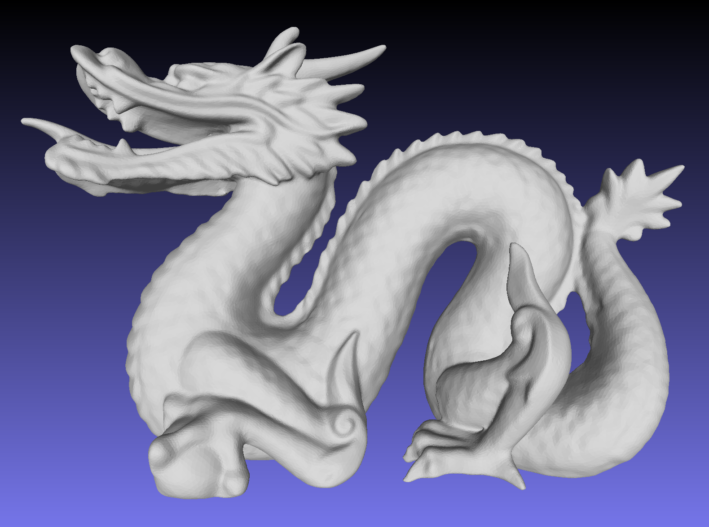
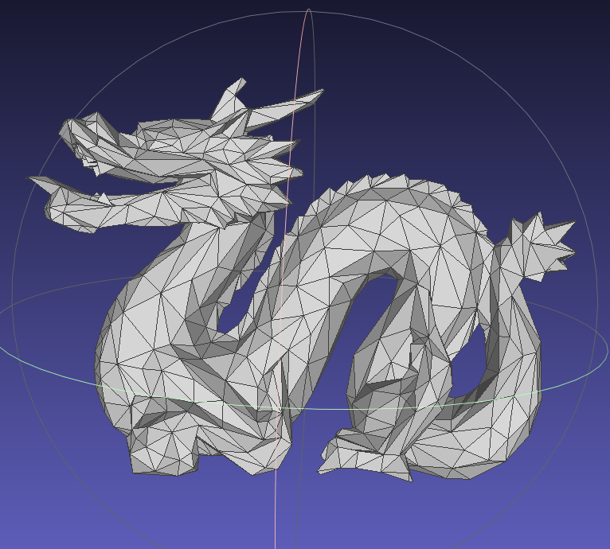
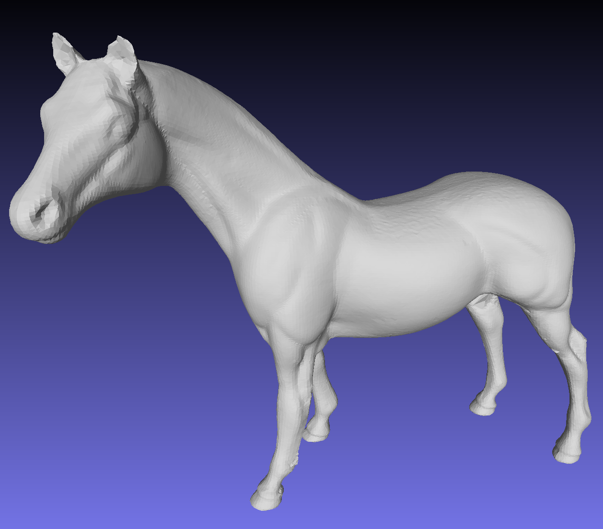

# Mesh Simplification

Course Project 1, Computer Graphics, Tsinghua University

Our task is to implement a classical Mesh Simplification algorithm "Surface Simplification Using Quadric Error Metrics", SIGGRAPH 97.

## Run My Code

I implement the algorithm in C++ for efficiency and use `Makefile` as the build tool. Make sure your environment has a C
++ compiler (`g++` or `clang++`). Then run the following command in the root directory. The binary `ms` (short for `mesh simplify`) will be compiled and built.

```bash
bash build.sh
```

Run examples under `obj/`, using:

```bash
./ms obj/Input/Dragon.obj obj/MyOutput/Dragon_0.1.obj 0.05
```

Here `0.05` is the simplification ratio (the number of faces of the result / the original faces number). The threshold used in pair selection is hardcoded as `0.01` in `main.cpp`, which you can also modify.


## Result

Note: `threshold=0.01` in all following settings.

### Visualization of Some Examples



Example 1: Dragon.obj, ratio=0.05, Vertices: 1047, Faces: 10460



Example 2: Dragon.obj, ratio=0.01, Vertices: 1047, Faces: 2091



Example 3: Horse.obj, ratio=0.01, Vertices: 486, Faces: 968


