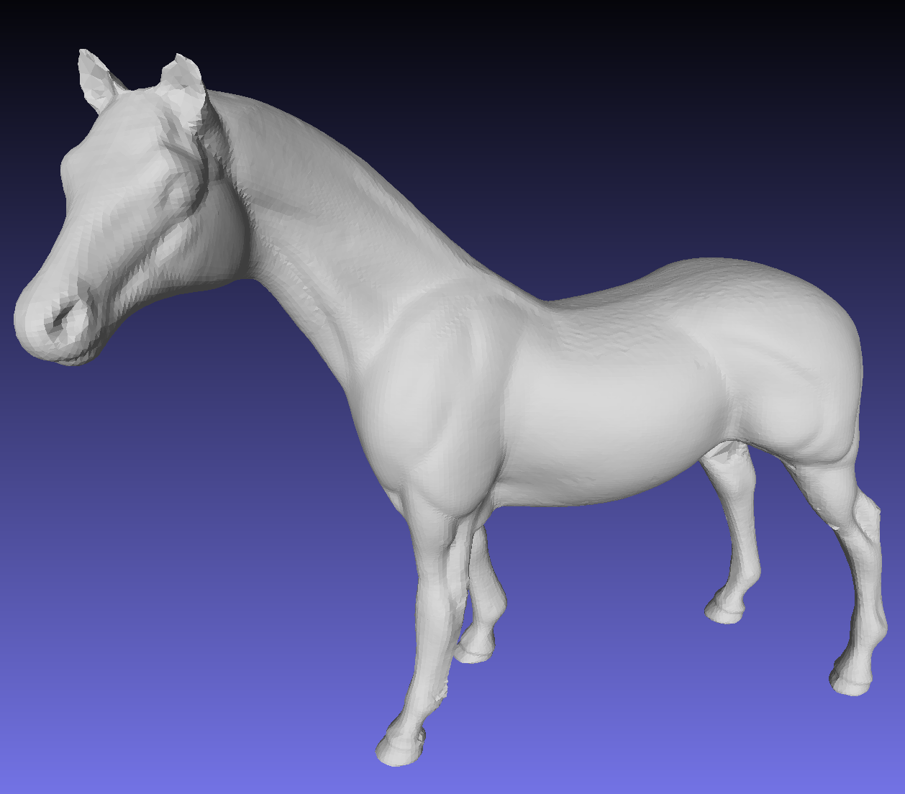

# THU Computer Graphics

70240243 Computer Graphics Course Project, Tsinghua University. The source code and the reports are organized in each subdirectory.

- [Project 1: Implement a Mesh Simplification Algorithm "Surface Simplification Using Quadric Error Metrics", SIGGRAPH 97 in C++](MeshSimplification/)

- [Project 2: Diffusion Using Jittor]()

