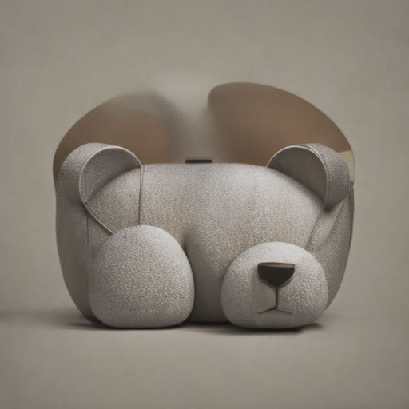
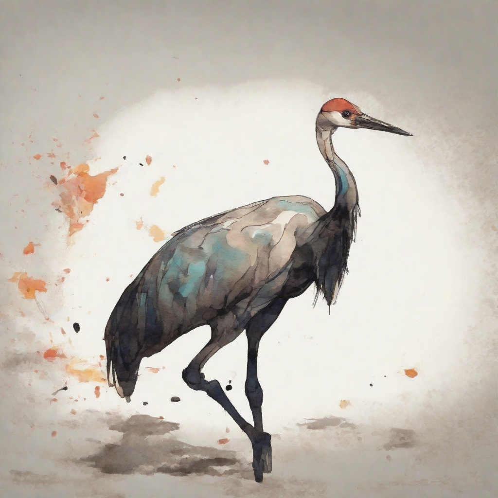
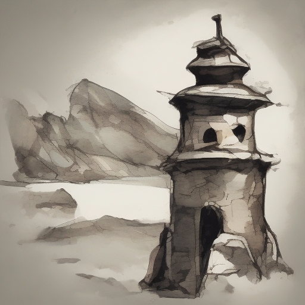
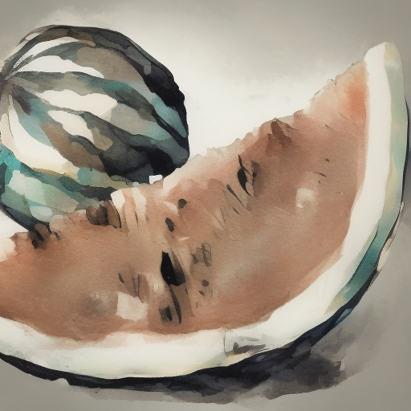
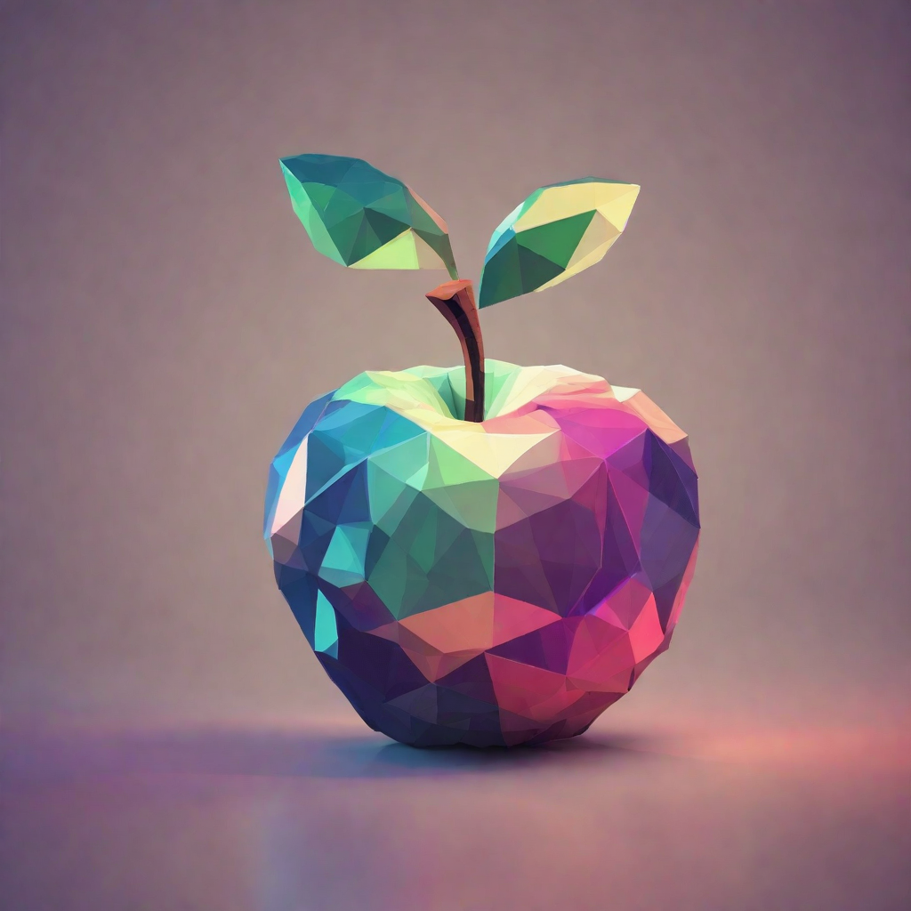
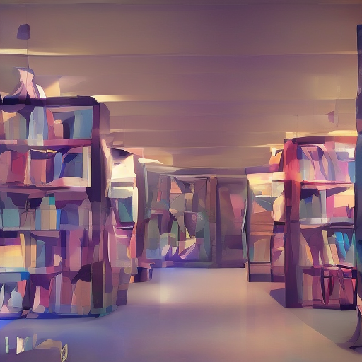
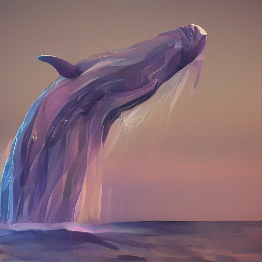

# THU Computer Graphics

   

<i>These images are generated by stable diffusion implemented based on jittor in this homework.  </i>

70240243 Computer Graphics Course Project, Tsinghua University. The source code and the reports are organized in each subdirectory.

## [Project 1: Implement a Mesh Simplification Algorithm "Surface Simplification Using Quadric Error Metrics", SIGGRAPH 97 in C++](MeshSimplification/)

## [Project 2: Style Transfer Using Diffusion (Implemented in Jittor)](StyleTransferDiffusion/)

|                                     Referred Style Input                                     |                                              Pic 1                                               |                                              Pic2                                              |                                               Pic3                                                |
| :------------------------------------------------------------------------------------------: | :----------------------------------------------------------------------------------------------: | :--------------------------------------------------------------------------------------------: | :-----------------------------------------------------------------------------------------------: |
|  |  |    |  |
|                                            Crane                                             |                                            Pineapple                                             |                                             Tower                                              |                                            Watermelon                                             |
|  |        |  |       |
|                                            Apple                                             |                                               Bag                                                |                                            Library                                             |                                               Whale                                               |
