# JStyleID: Style Injection in Diffusion Using JDiffusion

Course Project 2, Computer Graphics, Tsinghua University

本次作业要求是使用 jittor/jDiffusion 深度学习框架实现基于 Diffusion 的风格迁移算法，模型基于 Stable Diffusion-2.1。本作业基于 jittor 实现了 [[CVPR 2024] Style Injection in Diffusion: A Training-free Approach for Adapting Large-scale Diffusion Models for Style Transfer](https://github.com/jiwoogit/StyleID) 风格迁移算法，并且在指定的数据上进行了测试。

## Task Description

本次作业基于 [第四届计图人工智能挑战赛](https://www.educoder.net/competitions/index/Jittor-5) 的赛题二，目标是实现一个风格迁移算法。测试集分为 A、B，每个测试集有若干种风格，对于每种风格，`images/` 下会给出一些示例图片供我们模型学习 / 微调，而 `prompt.json` 文件会给出一系列和风格无关的 Prompts（一般是一个描述实物的单词），我们需要在学习后对这些 prompt 生成风格迁移后的图片。模型均使用 Stable Diffusion 2.1。

## Algorithm Design

本作业算法采用 StyleID：[[CVPR 2024] Style Injection in Diffusion: A Training-free Approach for Adapting Large-scale Diffusion Models for Style Transfer](https://github.com/jiwoogit/StyleID)。StyleID 是一个 training-free 的风格迁移方法，它直接基于一个 pretrain 好的 diffusion model 即可进行工作（不用微调或者 textual inversion）。这一工作的核心思想正如其名，它将风格“注入”到模型之中，更详细地讲，就是在注意力机制中用风格输入的K和V代替原始内容的K和V。

### Background

Latent Diffusion Model (LDM) 是一个在低维的 latent space 上训练过的 diffusion model。给定一张大小为 $H \times W \times 3$ 的图片，encoder 会将图片 encode 成一个 latent 空间上的表示 $h \times w \times c$，然后 decoder 会从 latent 重新构建原来的图形。这篇工作基于 Stable Diffusion (SD), 其误差预测部分是一个 U-Net 架构，由 residual block，self-attention block (SA) 和 cross attention block (CA) 组成。本工作着眼于 SA 部分，

### Method

一开始明确我们的任务：风格迁移给定一个 content image $I^c$ 和一个 style image $I^s$，我们需要将 style image 的“风格”迁移到 content image 上，然后得到的图像 $I^{cs}$ 会保持 $I^c$ 的 semantic content，同时它的风格（例如材质等）是 $I^s$ 中的。整体算法流程如下图所示（其中 $z_t^c$, $z_t^s$, $z_t^{cs}$ 分别对应 $t$ 时刻的 content image，style image 和生成的风格迁移图像）。

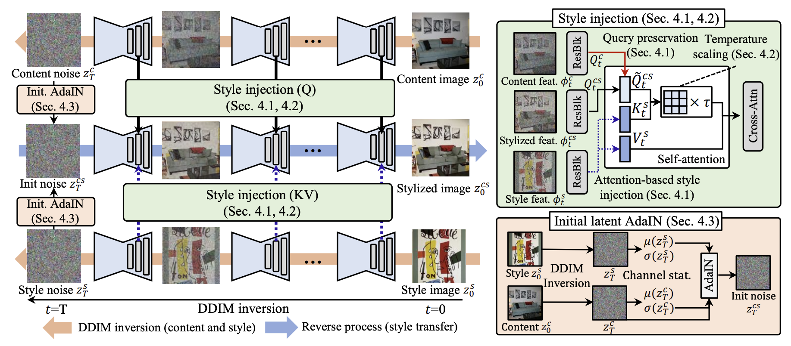

## Implementation

### Algorithm Part

代码实现在 `JStyleID/` 下。由于 StyleID 是一个 training free 方法，其不需要进行额外的训练或者微调。实现上，StyleID 只需要修改 Diffusion 模型的 self-attention block (SA) 模块。我们的实现基于 [StyleID 的 PyTorch 版本](https://github.com/jiwoogit/StyleID) 对 Jittor 进行适配。对于大部分算子，可以直接将 `torch.xxx` 改成 `jittor.xxx` 即可。部分算子由于接口问题需要特殊处理，例如在计算 latent 的标准差时需要用到 `torch.std`，但是 `jittor.std` 不支持 `dim` 参数，因此这里我们对前两维 `N, C` 采用简单的 for 循环（因为维数不多），对后面调用 `jittor.std`。

在实现完最初版本的 StyleID 后，我们观察到一开始的效果比较一般。这是因为本任务的目标是从文字的 Prompt 生成对应风格的图片，
而 StyleID 的输入则是 content image 与 style image，因此这里我们一开始采用了如下生成 pipeline

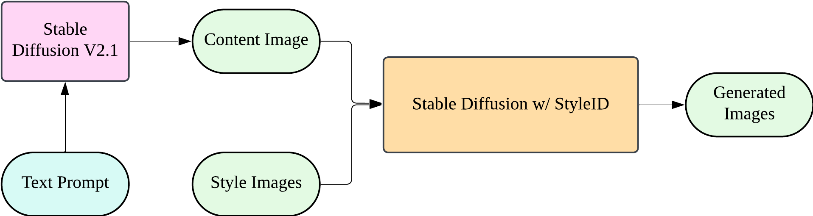

这种方式的主要问题是 content image 的质量可能参差不齐，而且有的可能会与对应的风格不匹配。因此我们对此做了改进，将 StyleID 改为用于 Dreambooth 之上再进行生成。经改善后我们效率提升了很多。

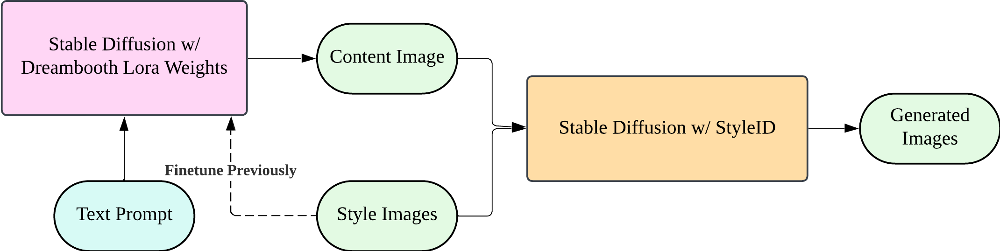

### System Optimization

由于数据集的风格较多，正常的顺序执行通常需要等待很多时间。我们可以在多卡环境下并行运行实现加速。同时我们发现在上面设计的 Pipeline 中，我们可以分离 content image 的生成以及 StyleID 注入两部分。因此我设计了如下 producer-consumer 架构。在实际实验运行上，该架构能产生一个可观的加速比。

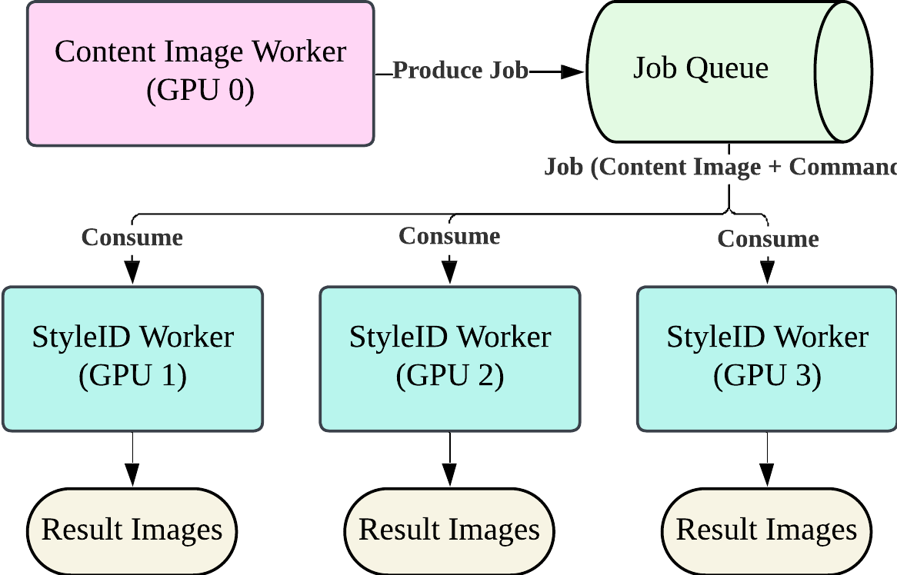

## Evaluation

我们使用挑战赛中使用的评分公式对结果计算一个总得分（得分越高越好），结果如下：

| Methods/Dataset       | A_gt  | B     |
| --------------------- | ----- | ----- |
| Dreambooth            | 0.317 | 0.203 |
| StyleID               | 0.337 |       |
| StyleID w/ Dreambooth | 0.376 |       |

其中 `StyleID` 为只使用 StyleID 算法，使用 SD v2.1 模型直接生成 content image 再进行风格注入的方法；`StyleID w/ Dreambooth` 为使用 Dreambooth 生成 content image 再进行风格注入的方法。以下是风格迁移结果的图片展示：

|                         Referred Style Input                          |                                   Pic 1                                   |                                  Pic2                                   |                                    Pic3                                    |
| :-------------------------------------------------------------------: | :-----------------------------------------------------------------------: | :---------------------------------------------------------------------: | :------------------------------------------------------------------------: |
| 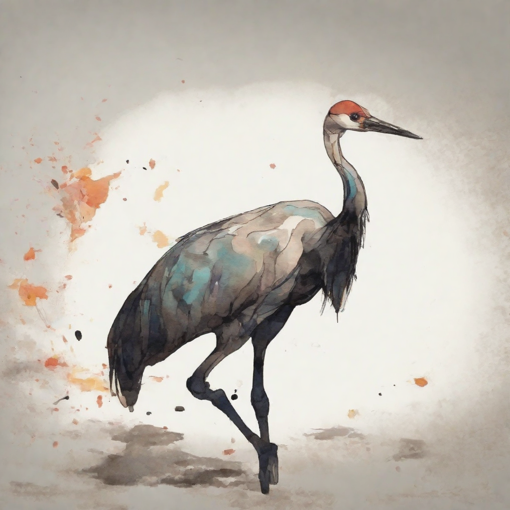 | 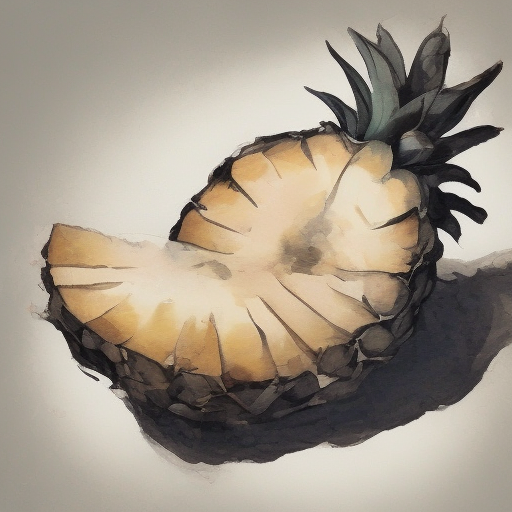 |  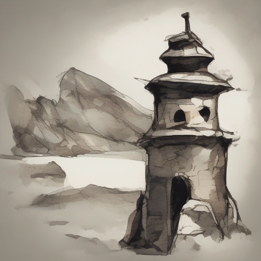  | 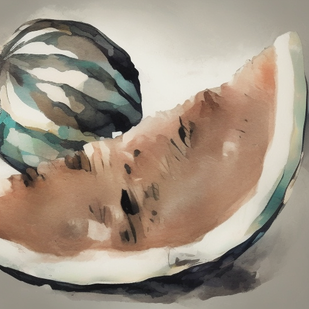 |
|                                 Crane                                 |                                 Pineapple                                 |                                  Tower                                  |                                 Watermelon                                 |
| 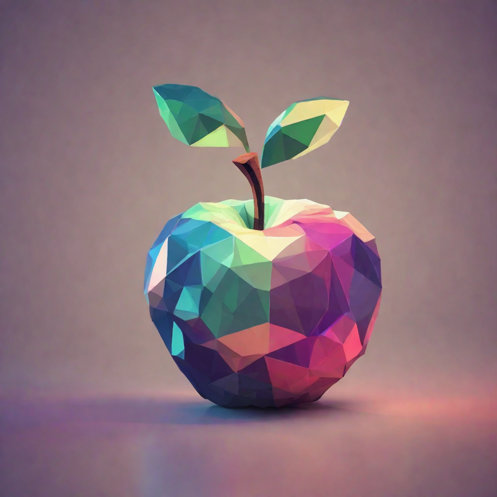 |    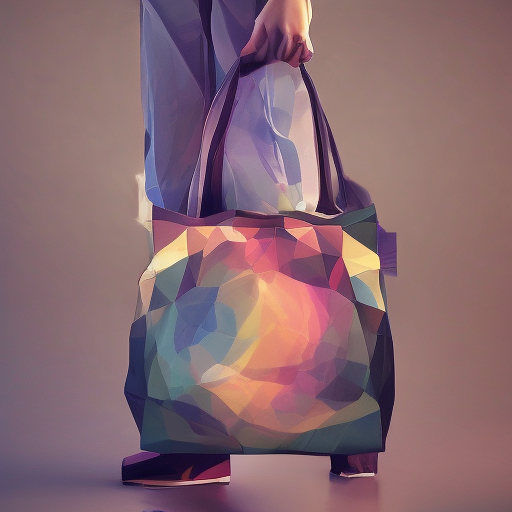    | 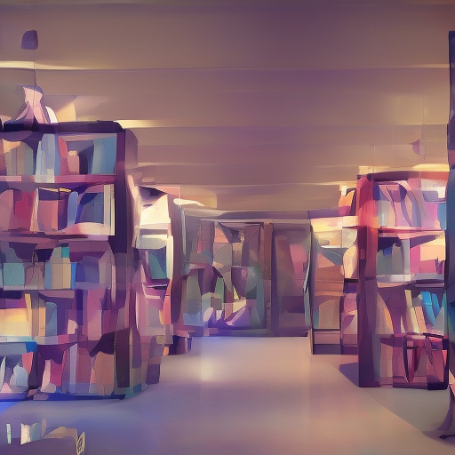 |       |
|                                 Apple                                 |                                    Bag                                    |                                 Library                                 |                                   Whale                                    |


## Reproduction

本部分内容用于复现代码结果。本项目主要包含自己实现的算法代码部分以及 baseline、评分脚本等第三方代码，为了方便测试有些部分直接放在一起。为了避免仓库过大，数据集等较大文件略去，需要自行拷贝到对应位置。

### Checker

`checker/` 目录下基于课程下发的评分脚本 `jdiff_checker.zip` 修改而来。`checker` 运行本身不依赖 `jittor`，并且在 `jittor` 环境下会因为 `jtorch` 接管 torch API 而报兼容性错误。因此我们在运行环境中将 jittor 运行环境与 checker 运行环境分离为两个 conda 环境。checker 相关依赖已整理为 `requirements.txt` 放于目录下，其为纯 PyTorch 环境。构建环境命令：

```bash
conda create -n jdiff_eval python=3.9
conda activate jdiff_eval
pip install -r requirements.txt
```

然后运行 `check.sh` 得到分数。注意修改相关路径，其中 `upload_path` 指的是待评测算法生成的图片的路径，应该是一个由不同风格编号组成的目录（`00/`，`01/`，...），`result_path` 是我们打分结果输出的路径。第一次运行时候我遇到了 `lpip_score` 在评测的时候报了如下错误：
```bash
RuntimeError: Expected all tensors to be on the same device, but found at least two devices, cuda:0 and cpu!
```
发现 `lpips_api.py` 里把输入换到了 cuda 上，去掉 `.to("cuda")` 就正常了。

此外，我们修改下发的代码，按照第四届计图人工智能挑战赛的官方公式计算出一个最后的分数。最后跑 Dreambooth（baseline）得到的样例结果如下所示：
```bash
{'dino_score': 0.11715544770043344, 'hist_score': 0.4336967518584978, 'fid_score': 2.8706912994384766, 'lpip_score': 0.5312565565109253, 'clip_iqa_score': 0.4336967518584978, 'clip_r_score': 0.8133333333333334, 'final_score': 0.31729219724423535}
time:  350.2937650680542
```


### Jittor and JDiffusion

JDiffusion 是一个基于 jittor 实现的 Diffusion 算法库，我们的 baseline 为基于 JDiffusion 实现的 DreamBooth-LoRA 算法，因此首先需要安装 JDiffusion。请将[代码仓库](https://github.com/JittorRepos/JDiffusion) clone 至本项目的根目录，并按照 README 说明配置环境。该环境也是我们之后的 jittor 运行环境。配置完后可以先测试 jittor 是否检测到正确的 CUDA 环境：

```bash
python3 -m jittor.test.test_cuda
```

如果发生错误，一般是没有指定正确的路径。jittor 使用 `nvcc_path` 环境变量来指定 `nvcc` 编译器（二进制可执行文件）的地址，可以通过修改项目根目录中的 `.cuda_path` 环境配置文件，然后执行

```bash
source .cuda_path
```

jittor 也可以为你安装正确的 CUDA & cuDNN，执行下述命令会将一个版本正确的 CUDA 安装在 `$HOME/.cache/jittor/jtcuda/` 下：

```bash
python3 -m jittor_utils.install_cuda
```

测试完 jittor 后可以测试 JDiffusion 是否运行正常，运行样例中的 `test_stable_diffusion.py` 如果能正常出图即可。

### Baseline

我们的 baseline 放置在 `JDiffusion/examples/dreambooth` 下，具体运行方式可查看这个文件夹下的 README。其为基于 LoRA 的微调算法。在我们的数据集中，每种类别我们会给出 10 张样例图，以及 25 条 prompts。Dreambooth-LoRA 会在这些样例上进行微调学习对应的风格。对于每个风格它都要微调一个对应的权重，train 完之后会放在目录下的 `style/` 文件夹下。推理时，它会读入对应 prompt，然后在 `output/` 下生成对应的风格迁移图像。

### Reproduce Our Method

在按照上述方式配置完环境后，同时你会有两个 conda 环境：`jdiff_eval` 和 `jdiffusion`，Python 版本均为 3.9。我们使用 `jdiffusion` 环境，然后进入 `JStyleID/` 目录。我们首先可以测试 StyleID 风格迁移：

```bash
bash test_styleid.sh
```

可以在 `results/` 下找到 `cat.jpg` 在不同风格下的示例生成图。对于我们数据集的实验，先在 `run_all.py` 中修改对应的数据集位置、结果保存位置以及环境的 GPU 数量。然后运行以下命令开始生成，在 4 卡 RTX3090 下 `A_gt` 数据集用时约 2h，`B` 数据集用时约 4h。

```bash
python3 run_all.py
```


## Related Links

- Jittor Tutorial: https://cg.cs.tsinghua.edu.cn/jittor/tutorial/
- Jittor API doc: https://cg.cs.tsinghua.edu.cn/jittor/assets/docs/index.html
- 第四届计图人工智能挑战赛: https://www.educoder.net/competitions/index/Jittor-5
- Baseline: https://github.com/JittorRepos/JDiffusion/tree/master/examples/dreambooth

Related Works on Style Transfer:
- StyleDrop: Text-to-Image Generation in Any Style: https://arxiv.org/abs/2306.00983
- Style Aligned Image Generation via Shared Attention: https://arxiv.org/abs/2312.02133
- Style Injection in Diffusion: A Training-free Approach for Adapting Large-scale Diffusion Models for Style Transfer：https://arxiv.org/abs/2312.09008

Referred Code:
- StyleID Official Implementation: https://github.com/jiwoogit/StyleID
- StyleBooth: https://github.com/lee12332/StyleBooth/
